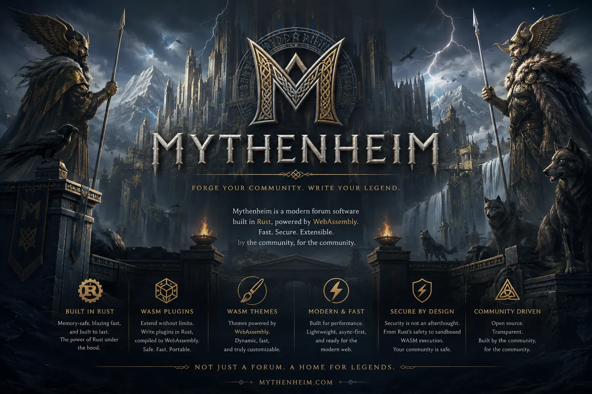

<p align="center">
  <b>Security-first Rust forum platform for serious communities.</b><br>
  API-first. Moderation-aware. Built for SurrealDB, rootless containers, Fluxheim, and WASM extension boundaries.
</p>

<div align="center">
  <a href="https://mythenheim.eu">Home Page</a>
  &middot;
  <a href="docs/architecture-plan.md">Architecture</a>
  &middot;
  <a href="docs/version-plan.md">Version Plan</a>
  &middot;
  <a href="SECURITY.md">Security</a>
  &middot;
  <a href=".github/CONTRIBUTING.md">Contributing</a>
</div>

<br>

<p align="center">
  
</p>

# Mythenheim

Mythenheim is a security-first forum platform written in Rust. It aims to cover
the durable workflows expected from mature forum communities while keeping a
stricter execution boundary: Rust core, SurrealDB storage, rootless Podman
operation, and sandboxed extension points.

The compiled Mythenheim binary targets Linux, macOS, and Windows. Linux remains
the container and rootless Podman target, while direct binary deployments should
stay portable across the supported operating-system families. BSD is kept as a
best-effort source portability goal, not a release-blocking target.

The project started at `0.10.0` and is currently `0.12.0`. Releases before
`1.0.0` are incubator releases: every version has tests and docs, but public
APIs and database schema can still change. `1.0.0` is the first stable
production forum core.

Production origin: `https://mythenheim.eu`.

Local development origin on this machine, when DNS/proxying is needed:
`https://dev.mythenheim.eu`.

## Current Scope

- Rust `1.95.0`, edition `2024`.
- Axum health service.
- TOML config loader and validator.
- Safe Markdown preview renderer backed by `pulldown-cmark` and `ammonia`.
- Capability string validator for the RBAC/ABAC permission plan.
- Preview RBAC/ABAC permission resolver with trust-level grants, scoped roles,
  ownership checks, and role-assignment escalation prevention.
- Password hashing, opaque session-token primitives, preview auth routes, and
  login lockout hooks.
- Preview category/topic/post API with nested category reads, private
  categories, direct post reads, edit revisions, soft deletes, pagination, and
  sanitized Markdown rendering.
- Versioned SurrealDB schema migrations for identity, roles, sessions,
  categories, topics, posts, moderation, audit logs, and graph edges.
- Migration validation CLI and rootless SurrealDB migration smoke test.
- Fluxheim-inspired checks: format, clippy, tests, release metadata, doc links.
- Rootless Podman helper that starts SurrealDB on a random local port for tests.
- Fluxheim Wolfi reverse-proxy smoke fixture.
- Binary portability CI for Linux, Windows, and macOS.
- Versioned roadmap from `0.10.0` through `1.0.0` and later `1.x`.

## Architecture Direction

Mythenheim is API-first and deployment-conscious:

- Axum and Tokio for HTTP service code.
- SurrealDB for document and graph storage.
- Opaque server-side sessions instead of primary stateless session tokens.
- Server-side content parsing and sanitization.
- Capability-based permissions with contextual ownership checks.
- Rootless Podman and direct compiled-binary deployment.
- Direct binary portability across Linux, macOS, and Windows.
- Fluxheim reverse-proxy compatibility for `mythenheim.eu` and
  `dev.mythenheim.eu`.
- OpenTelemetry and Prometheus planned before `1.0.0`.
- WebAssembly plugins and theme/template safety after the stable forum core.

## Quick Start

```sh
cargo run -- --check-config --config examples/mythenheim.toml
scripts/checks.sh
```

Run the development HTTP service:

```sh
cargo run -- --config examples/mythenheim.toml
```

Default example listener: `127.0.0.1:37171`.

Start a rootless SurrealDB test container on a random host port:

```sh
scripts/start_surrealdb_test.sh
```

The script prints a `MYTHENHEIM_DATABASE_ENDPOINT=...` line that can be used by
future integration tests.

Validate and print the SurrealDB schema migrations:

```sh
cargo run -- --check-migrations
cargo run -- --print-migrations
```

Build a local validation release binary from the current checkout:

```sh
python3 scripts/build_release_binary.py linux --repo . --ref HEAD --allow-untagged
```

Exercise the preview auth API while the local service is running:

```sh
curl -sSf -X POST http://127.0.0.1:37171/api/v1/auth/register \
  -H 'content-type: application/json' \
  -d '{"username":"Member","email":"member@example.test","password":"correct horse battery staple"}'
```

Apply the generated migrations twice against a temporary rootless SurrealDB
container:

```sh
scripts/smoke_surrealdb_migrations.sh
```

Run the Fluxheim Wolfi reverse-proxy smoke:

```sh
scripts/smoke_fluxheim_wolfi.sh
```

This builds or reuses a Fluxheim Wolfi image and verifies both `mythenheim.eu`
and `dev.mythenheim.eu` through the proxy.

## Documentation

- [Architecture plan](docs/architecture-plan.md)
- [Forum feature investigation](docs/forum-feature-investigation.md)
- [Version plan](docs/version-plan.md)
- [Build and test guide](docs/build-and-test.md)
- [Authentication and session plan](docs/auth-session-plan.md)
- [Forum core preview](docs/forum-core-preview.md)
- [Permissions preview](docs/permissions-preview.md)
- [Platform support](docs/platform-support.md)
- [Release binary builds](docs/release-binaries.md)
- [Rootless SurrealDB testing](docs/surrealdb-test-podman.md)
- [Fluxheim proxy deployment](docs/fluxheim-proxy.md)
- [Observability plan](docs/observability.md)
- [Release checklist](docs/release-checklist.md)
- [Security policy](SECURITY.md)
- [Contributing guide](.github/CONTRIBUTING.md)

## Project Hygiene

- Pull requests use [.github/PULL_REQUEST_TEMPLATE.md](.github/PULL_REQUEST_TEMPLATE.md).
- Public issues use structured templates under `.github/ISSUE_TEMPLATE`.
- Dependabot checks Rust and GitHub Actions weekly.
- CI runs formatting, release metadata validation, doc link checks, clippy,
  tests, reduced feature builds, local smoke, binary portability checks,
  dependency policy, and advisory checks.
- Container image builds are handled by `.github/workflows/container.yml`.
- The expensive Fluxheim Wolfi proxy smoke is manual through
  `.github/workflows/fluxheim-wolfi-smoke.yml`.

## License

Mythenheim is licensed under the European Union Public Licence 1.2. See
`LICENSE` and `NOTICE`.
